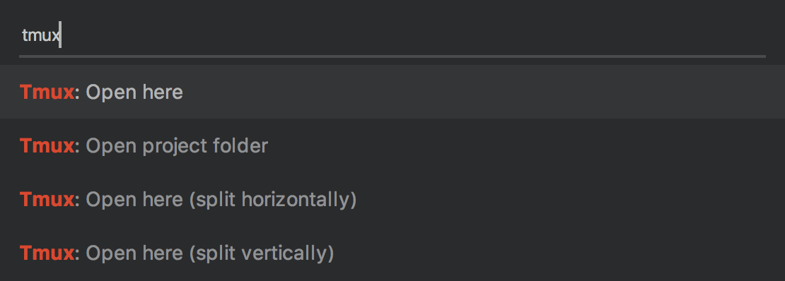

# SublimeTmux

Commands to open [tmux](https://github.com/tmux/tmux#readme) windows at the current file or root project folder in [Sublime Text](https://www.sublimetext.com/).

## Installation

Soon to be available on [Package Control](https://packagecontrol.io/). Until then, place this repository in your `Packages/` directory.

## Usage

For now, *SublimeTmux* requires a local tmux server to be running. In practice this means it will only run actions whilst you have an open tmux session in your terminal emulator.

Once installed, a number of tmux-related commands are available in the Command Palette, activated with *ctrl*+*shift*+*p*:

If you wish to run these commands from your own keybinding, edit the config file under **Preferences: Key Bindings**, where they can be set along with any arguments.

### Commands

#### `open_tmux`

Open a new tmux window at the directory of the current file.

#### `open_tmux_project_folder`

Open a new tmux window at the current root project directory.

### Command arguments

These properties may be set as part of the `args` object for any command.

| Property | Type | Default | Description |
| --- | --- | --- | --- |
| **`split`** | `string`  | `null` | If set, a new pane in the current window will be opened. The direction of the split can be set to either `"horizontal"` or `"vertical"` (default). |

### Package settings

Default, user-level and OS-specific settings files can be accessed under **Preferences > Package Settings > SublimeTmux**.

| Property | Type | Default | Description |
| --- | --- | --- | --- |
| **`set_project_window_name`** | `bool`  | `true` | Set whether new windows created with `open_tmux_project_folder` should be created with their name set to that of the directory opened. This is useful to identify multiple window tabs across projects. |

## Contributing

If you discover a problem or have a feature request, please create an issue or feel free to fork this repository and make improvements.
